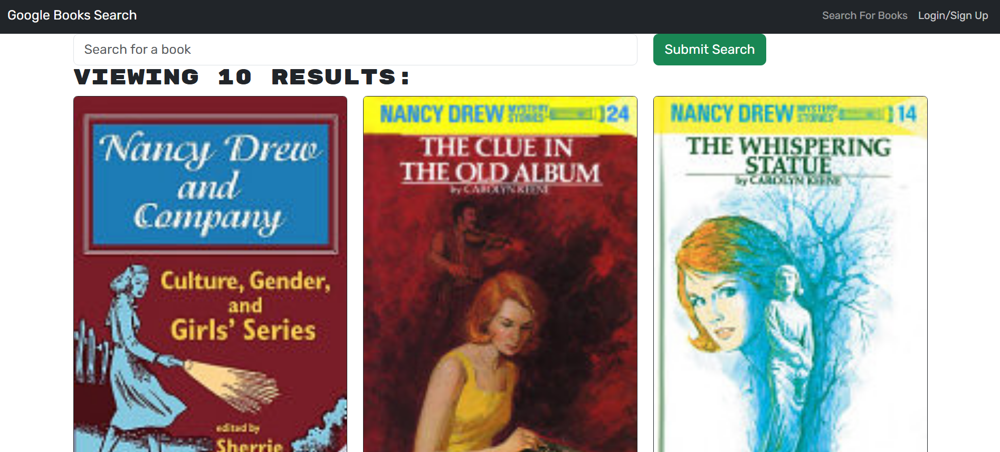

# 📚 Book Finder App
The Book Finder App is a web application that allows users to search for books, view detailed information, and manage their favorite reads. This app leverages external APIs to fetch book data and provides an intuitive interface for book lovers.

🚀 Features:

🔍 Search Books: Quickly search for books by title, author, or keywords.

📖 Book Details: View detailed information about each book, including its description, author, publication date, and ratings.

❤️ Save Favorites: Add books to your favorites list for easy access later.

📱 Responsive Design: Fully optimized for desktop and mobile devices.

# 🛠️ Technologies Used

Frontend:
React, HTML5, CSS3, Typescript, 

Backend:
Node.js, Express.js

Database:
MongoDB (for storing user data and favorite books)

APIs:

Google Books API 

